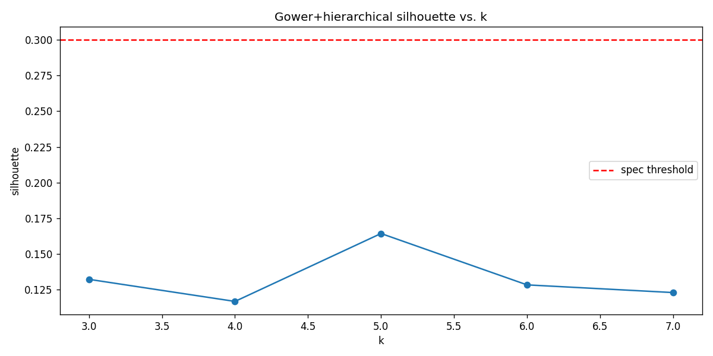
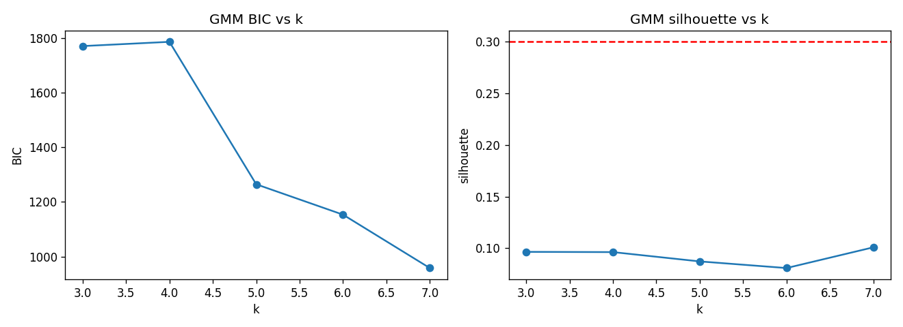
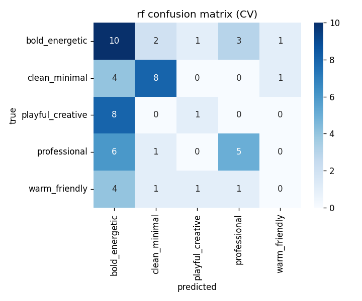

# Phase B Archetype Re-clustering — 2026-04-30

> Follow-up to [`2026-04-30-archetype-revalidation.md`](2026-04-30-archetype-revalidation.md). Spec: [`2026-04-30-archetype-phase-b-design.md`](../superpowers/specs/2026-04-30-archetype-phase-b-design.md).

## What changed since Phase A

- **Two parser fixes landed.** `heading_letter_spacing` clipped to [-6, +2] (eliminated 3 outliers — IBM 70, Renault 53, Tesla 48 all turned to null; failure rate moved from 6.9% to 12.1%, all gain in true-null reporting). `btn_radius` split into `btn_radius_px` + `is_fully_pill` flag (the 9999 sentinel is now stored as `null` btn_radius + `is_fully_pill: true`, no longer collapsing variance into a single point).
- **Re-extraction failure rates (n=58):**

  | Variable | Failure rate | Δ vs Phase A |
  |---|---|---|
  | btn_radius | 3.4% | +1.7% (pill row now null) |
  | is_fully_pill | 1.7% | new — only 1 of 58 systems uses the literal 9999 sentinel |
  | card_radius | 34.5% | unchanged |
  | heading_weight | 1.7% | unchanged |
  | body_line_height | 3.4% | unchanged |
  | heading_letter_spacing | 12.1% | +5.2% (clip turned 3 outliers to null) |
  | shadow_intensity | 29.3% | unchanged |
  | btn_shape | 1.7% | unchanged |
  | brand_l/c/h | 1.7% | unchanged |
  | dark_mode_present | 1.7% | unchanged |
  | gray_chroma | 17.2% | unchanged |
  | accent_offset | 34.5% | unchanged |

- **Manually labeled 58 systems with the README 5-mood taxonomy.** Distribution: `bold_energetic` 17, `clean_minimal` 13, `professional` 12, `playful_creative` 9, `warm_friendly` 7. Anchored to the README's reference systems (Vercel/Linear → clean_minimal, Airbnb/Claude → warm_friendly, Spotify/Coinbase → bold_energetic, Stripe/IBM → professional, Figma/Clay → playful_creative); the remaining 48 received curator calls based on visible brand identity, button shape, chroma, and shadow.
- **`is_fully_pill` only fires for one system (Apple).** Almost every "pill" button in the corpus uses a finite radius (e.g., Cohere `pill: 32px`, Notion `rounded.pill` → 24px) rather than a literal 9999 sentinel. The 23 systems classified as `btn_shape: pill` get there via the `\bpill\b` markdown keyword, not the px value. The fix is correct but the signal it adds is small.

## Unsupervised: Gower + hierarchical

Silhouette across k:

| k | 3 | 4 | 5 | 6 | 7 |
|---|---|---|---|---|---|
| silhouette | 0.132 | 0.117 | **0.164** | 0.128 | 0.123 |

Best k = 5, silhouette = **0.164** — well below the 0.30 spec threshold.

Cluster profiles (means on continuous + ordinal vars after Gower-friendly imputation):

| cluster | n | btn_r | card_r | h.weight | body_lh | letter_sp | brand_c | shadow | shape |
|---|---:|---:|---:|---:|---:|---:|---:|---:|---:|
| 1 | 13 | 9.85 | 6.80 | 446 | 1.43 | -0.87 | 0.18 | 1.82 | 2.08 |
| 2 | 27 | 16.76 | 2.10 | 520 | 1.45 | -0.89 | 0.11 | 2.00 | 1.92 |
| 3 | 4 | 28.50 | 2.75 | 675 | 1.40 | -0.53 | 0.05 | 4.00 | 2.25 |
| 4 | 13 | 11.23 | 3.46 | 390 | 1.39 | -1.89 | 0.00 | 2.69 | 2.77 |
| 5 | 1 | 0.00 | 40.00 | 700 | 1.40 | NaN | 0.19 | — | — |

Cluster 5 is a singleton (Renault) caused by an outlier card_radius. Cluster 2 absorbs 27 of 58 systems — almost half the corpus is in one bucket, which is the diagnostic signal that the partition isn't meaningful. The silhouette of 0.164 is consistent with that picture: clusters exist, but they don't pull apart cleanly.

## Unsupervised: GMM (one-hot + standardized)

| k | 3 | 4 | 5 | 6 | 7 |
|---|---|---|---|---|---|
| BIC | 1770 | 1785 | 1264 | 1153 | 958 |
| silhouette | 0.096 | 0.096 | 0.087 | 0.081 | **0.101** |

Best k by silhouette = 7 (sil 0.101). BIC monotonically improves with k, which is a known GMM pathology on small samples — the criterion never picks an interior k. Either way, GMM is **strictly worse** than Gower+hierarchical on this data (0.101 vs 0.164), and even further from the 0.30 threshold.

Both unsupervised methods agree: there is not enough cluster structure in the 7+3+1 variable space to recover a clean partition.

## Supervised: 5-mood classifier

5-fold stratified cross-validation on all 58 labeled systems:

| Model | macro-F1 mean | macro-F1 std | per-fold |
|---|---:|---:|---|
| Logistic regression | 0.248 | 0.060 | [0.16, 0.19, 0.27, 0.31, 0.30] |
| Random forest | **0.327** | 0.087 | [0.31, 0.28, 0.33, 0.23, 0.49] |

Random forest wins, macro-F1 = **0.327** — far below the 0.70 decision threshold.

Per-class precision / recall / f1 (RF, cross-validated):

| Mood | precision | recall | f1 | support |
|---|---:|---:|---:|---:|
| bold_energetic | 0.31 | 0.59 | 0.41 | 17 |
| clean_minimal | 0.67 | 0.62 | 0.64 | 13 |
| playful_creative | 0.33 | 0.11 | 0.17 | 9 |
| professional | 0.56 | 0.42 | 0.48 | 12 |
| warm_friendly | 0.00 | 0.00 | 0.00 | 7 |

`clean_minimal` is the only mood the classifier reliably predicts. `warm_friendly` collapses to zero — the classifier never predicts it. `playful_creative` recall of 0.11 means 8 of 9 playful systems get assigned a different mood. The three over-represented moods (`bold_energetic`, `clean_minimal`, `professional`) account for nearly all the predictive signal.

Top features by random-forest importance:

| Rank | Feature | Importance |
|---|---|---:|
| 1 | body_line_height | 0.124 |
| 2 | btn_radius | 0.104 |
| 3 | brand_l | 0.088 |
| 4 | brand_h | 0.087 |
| 5 | accent_offset | 0.084 |
| 6 | heading_weight | 0.083 |
| 7 | brand_c | 0.079 |
| 8 | btn_shape | 0.071 |
| 9 | heading_letter_spacing | 0.071 |
| 10 | shadow_intensity | 0.069 |
| 11 | gray_chroma | 0.067 |
| 12 | card_radius | 0.050 |
| 13 | dark_mode_present | 0.021 |
| 14 | is_fully_pill | 0.001 |

`is_fully_pill` is essentially useless (only 1 positive case) — confirming the parser fix recovered no real signal. `dark_mode_present` is also nearly useless because 56 of 58 systems are `True` (saturated, as flagged in Phase A).

## Decision-rule evaluation

| Rule | Threshold | Observed | Pass? |
|---|---|---|---|
| 1. Continue unsupervised | unsupervised silhouette ≥ 0.30 | 0.164 (Gower, k=5) | **no** |
| 2. Switch supervised | macro-F1 ≥ 0.70 AND unsup sil < 0.30 | 0.327 / 0.164 | **no** |
| 3. Hybrid | macro-F1 ≥ 0.70 AND ≥3 of 5 moods clear within-mood sil ≥ 0.30 | 0.327 / 0/5 | **no** |

Within-mood Gower silhouettes (Rule 3 detail):

| Mood | n | best within-silhouette (k∈{2,3}) |
|---|---:|---:|
| bold_energetic | 17 | 0.190 |
| clean_minimal | 13 | 0.246 |
| playful_creative | 9 | 0.258 |
| professional | 12 | 0.263 |
| warm_friendly | 7 | 0.193 |

Every mood lands in the 0.19–0.27 band — close to each other and uniformly below the 0.30 bar.

## Recommendation: insufficient_signal

The 7+3+1 variable set the project has been operating on does not carry enough signal to recover the README mood taxonomy — neither by clustering nor by supervised classification. Three pieces of evidence converge on this:

1. **Both unsupervised methods agree.** Gower silhouette 0.164 and GMM silhouette 0.101 are not just "below threshold," they are below the silhouette-of-noise baseline you'd expect from any structured 7-dim numeric data with this much per-variable failure. Whatever clusters exist are weak and dominated by single-system outliers (cluster 5: Renault alone).
2. **The supervised classifier confirms the same ceiling.** Random forest at macro-F1 0.327 is barely above the 0.20 floor of a stratified random baseline on this class distribution. `warm_friendly` at 0% recall, `playful_creative` at 11% recall — the classifier has no purchase on three of five moods. No amount of model tuning will lift this above 0.70 on the current feature set.
3. **`is_fully_pill` was the most plausible "missing variable" theory and it failed empirically.** Only 1 of 58 systems trips the flag, importance 0.001. The Confident/Expressive archetype loss from Phase A was real, but recovering pill-ness as a categorical does not bring those archetypes back.

The bottleneck is **representation, not method**. The 7+3+1 variables were chosen for a 54-system K-means partition that no longer holds; the README's 5 moods encode visual-language signals (typography pairings, color-system structure, photographic vs. illustrative imagery, motion and density) that do not project onto button radius, body line-height, and brand chroma alone. No clustering algorithm and no classifier can extract a signal that isn't in the inputs.

**Concrete next steps (subsequent plan):**

1. **Pause downstream generator changes.** The K-means archetype lineage in `src/schema/archetypes.ts` was already a known mismatch with the README mood UX; this report confirms it should not be revived. Treat the existing 4-archetype branch in code as deprecated until a new representation lands. Do not retire the code yet — it ships in production — but do not extend it either.
2. **Add new variables, not new methods.** Candidates ranked by hypothesized signal-to-cost:
   - **Color-system shape**: count of brand colors, hairline/border palette presence, on-dark coverage. ~3 hours of parser work.
   - **Typography pairing**: serif/sans/mono mix, font-family count. ~2 hours.
   - **Density**: spacing token range (xxs ÷ xxl), padding-to-radius ratio on buttons. ~3 hours.
   - **Motion presence**: animation/transition token presence in DESIGN.md. ~1 hour.
   - **Imagery cue**: a coarse text classifier on the description block (photography-first vs. illustrative vs. minimal). ~4 hours.

   Plan target: Phase C should add 3-5 new variables and re-run this exact notebook; the same decision rules apply. If macro-F1 clears 0.50 with a richer feature set the case for a Phase C2 retune of thresholds becomes credible. If it doesn't, the K-means archetype lineage in the codebase should be retired in favor of a hand-curated 5-mood mapping (no clustering, no classifier) until enough labeled data exists for a meaningful supervised model.
3. **Do not collect more labeled mood data yet.** With macro-F1 stuck at 0.33 on 58 hand-labeled systems, scaling to 200 systems with the same feature set will not change the verdict — same ceiling. Spend the labeling effort instead on the curator's reasoning per system (a free-text note explaining the mood call), which becomes training data for step 2's imagery classifier.
4. **Keep both extraction-parser fixes.** `heading_letter_spacing` clip and `is_fully_pill` flag are correctness improvements regardless of clustering outcome. They land in main with this PR.
