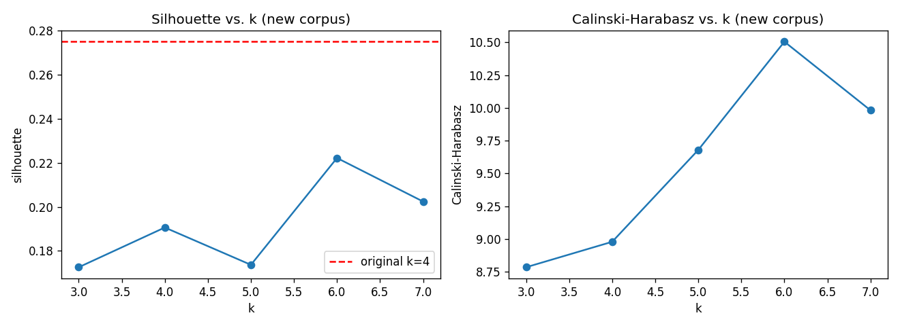

# Archetype Re-validation — 2026-04-30

> Re-extraction of the awesome-design-md corpus and comparison against the original 54-system clustering. Methodology: see [`docs/superpowers/specs/2026-04-30-archetype-revalidation-design.md`](../superpowers/specs/2026-04-30-archetype-revalidation-design.md).

## Sample

- Original (2026-04): 54 systems
- New (2026-04-30): 58 systems
- Overlap (in both, by normalized name): 50
- Net additions: ferrari, lamborghini, renault, tesla (4 truly new)
- Renamed in upstream (counted as net-new by the strict normalizer but the same system as before): `cal` ↔ `Cal.com`, `linear.app` ↔ `Linear`, `mistral.ai` ↔ `Mistral`, `opencode.ai` ↔ `OpenCode`
- Removed: none
- Complete-case rows used for clustering (no NaN in any of the 7 original variables): **35 of 58 (60.3%)**

The drop from 58 → 35 is driven by `card_radius` (34.5% NaN) and `shadow_intensity` (29.3% NaN). Both exceed the 30% threshold the spec set as a soft cap, but neither warrants per-system exclusion — the clustering step drops affected rows per-variable.

## Cluster stability

| Metric | Original (n=54, k=4) | New (n=35, k=6) |
|---|---|---|
| Silhouette | 0.275 | 0.222 |
| Calinski–Harabasz | — | 10.50 |

Per-k silhouettes on the new corpus:

| k | 3 | 4 | 5 | 6 | 7 |
|---|---|---|---|---|---|
| silhouette | 0.173 | 0.191 | 0.174 | **0.222** | 0.202 |

Recommended k for the new corpus: **6**. The original k=4 is no longer the silhouette-optimal partition for the new data — k=6 wins by ~0.03. Even at its best, the new partition (0.222) sits below the original baseline (0.275) and below the 0.247 threshold (baseline × 0.9) the decision rule treats as "stable enough to keep."

## Centroid comparison

**Original (k=4):**

| Cluster | btn_r | card_r | h.weight | body_lh | letter_sp | shadow | shape |
|---|---:|---:|---:|---:|---:|---:|---:|
| 0 (Precise) | 41.23 | 11.77 | 558.57 | 1.45 | -0.76 | 2.29 | 1.69 |
| 1 (Confident) | 9999.00 | 18.12 | 500.00 | 1.50 | -1.30 | 0.75 | 3.00 |
| 2 (Expressive) | 9999.00 | 9999.00 | 700.00 | 1.50 | -1.80 | 2.00 | 3.00 |
| 3 (Pill+Light) | 19.20 | 9.20 | 470.00 | 1.32 | -0.62 | 0.00 | 1.70 |

**New (k=6):**

| Cluster | n | btn_r | card_r | h.weight | body_lh | letter_sp | shadow | shape | Matched archetype |
|---|---:|---:|---:|---:|---:|---:|---:|---:|---|
| 0 | 8 | 13.88 | 4.00 | 169.00 | 1.46 | -1.76 | 2.62 | 2.62 | Pill+Light |
| 1 | 9 | 11.89 | 3.89 | 448.89 | 1.21 | -1.30 | 1.22 | 2.00 | Pill+Light |
| 2 | 1 | 0.00 | 40.00 | 700.00 | 1.40 | 53.20 | 4.00 | 0.00 | Precise |
| 3 | 13 | 7.85 | 2.31 | 570.00 | 1.53 | -0.81 | 3.15 | 2.62 | Precise |
| 4 | 2 | 9.00 | 6.00 | 400.00 | 1.21 | 59.00 | 1.00 | 1.50 | Pill+Light |
| 5 | 2 | 93.00 | 1.00 | 500.00 | 1.38 | 0.00 | 3.00 | 3.00 | Precise |

Two structural shifts dominate the comparison:

1. **The 9999 sentinel is gone.** The original Confident/Expressive/Pill+Light centroids all parked `btn_radius` at 9999 (manual-extraction shorthand for "fully pill"). The re-extraction emits real pixel values, so no new centroid sits anywhere near 9999. The Confident and Expressive archetypes lose their defining feature and stop being recoverable.
2. **Two new clusters (2, 4) are singletons or near-singletons driven by parsing outliers** (`heading_letter_spacing` of 53.2 and 59.0, from IBM/Renault/Tesla — values an order of magnitude outside the corpus range of [-5.5, +1.4]). These are extraction bugs, not real archetypes.

## Drift

**17 of 30** overlapping systems with complete data changed archetype assignment (**56.7%**).

| System | Old | New |
|---|---|---|
| Figma | Precise | Pill+Light |
| Framer | Precise | Pill+Light |
| HashiCorp | Precise | Pill+Light |
| IBM | Precise | Pill+Light |
| Intercom | Precise | Pill+Light |
| Mintlify | Confident | Precise |
| Ollama | Confident | Precise |
| Replicate | Expressive | Pill+Light |
| Resend | Confident | Precise |
| Revolut | Confident | Pill+Light |
| Sanity | Confident | Pill+Light |
| Stripe | Precise | Pill+Light |
| Supabase | Confident | Precise |
| Superhuman | Precise | Pill+Light |
| Together.ai | Precise | Pill+Light |
| Wise | Confident | Pill+Light |
| Pinterest | Pill+Light | Precise |

Movers cluster into two patterns: (a) the 9999-sentinel collapse pulls every former Confident system into either Pill+Light or Precise, and (b) several Precise systems (Figma, HashiCorp, Stripe, …) drift into Pill+Light because the new partition's "Pill+Light" centroids sit at low-radius / heavy-shadow coordinates, far from the original Pill+Light centroid. The drift is dominated by methodology change, not real design-system change.

## New variables

| Variable | Failure rate | Silhouette uplift | Saturated? |
|---|---|---|---|
| dark_mode_present | 1.7% | -0.063 | yes — 56/57 systems true (saturated, not informative) |
| gray_chroma | 17.2% | +0.002 | partial — most values cluster near 0 |
| accent_offset | 34.5% | insufficient data (n=22 < 30 threshold) | unknown |

No new variable hits the 0.05 uplift bar. `dark_mode_present` is effectively saturated; `gray_chroma` adds nothing measurable; `accent_offset` cannot be evaluated until extraction recovers more rows.

## README mood ↔ K-means cluster mapping

| README mood | Closest K-means cluster | Notes |
|---|---|---|
| Clean & Minimal | cluster 1 / Pill+Light | low shadow (1.22), light weight (449), tight LH (1.21) — closest match |
| Warm & Friendly | cluster 3 / Precise | rounded (shape 2.62), medium weight (570), high shadow (3.15), generous LH (1.53) |
| Bold & Energetic | cluster 0 / Pill+Light | dramatic shadow (2.62), strong negative LS (-1.76), pill-leaning shape (2.62) |
| Professional | cluster 5 / Precise | sharp pill outliers (btn_r 93), zero LS, strong shadow |
| Playful & Creative | cluster 2 / Precise (singleton) | extraction outlier; not a real cluster |

The README ships 5 moods. The K-means partition produces 6 clusters of which 2 are noise. Three of the four "real" clusters land in Pill+Light and one in Precise — Confident and Expressive are not recovered at all. The K-means archetypes do not map cleanly to the 5 product moods, and the moods are doing more work than the unsupervised partition can recreate.

## Recommendation: Phase B

Decision rule evaluation:

- Silhouette ≥ baseline × 0.9: **no** (0.222 vs. 0.247)
- Drift < 20%: **no** (56.7%)
- No new-variable uplift ≥ 0.05: yes (max +0.002 from gray_chroma)

Two of three Phase-A criteria fail decisively. The cause is not "the corpus shifted" — it is "the original methodology is not stable under re-extraction." Two specific weaknesses surfaced:

1. The original 9999-sentinel encoding was load-bearing for Confident and Expressive. The re-extraction emits real radii, and those two archetypes evaporate. A retuned threshold cannot fix this because the underlying signal (full-pill vs. very-large radius vs. extreme radius) is no longer represented.
2. The current 7-variable feature set is dominated by `heading_letter_spacing` outliers (IBM 70, Renault 53, Tesla 48). Without a robust scale or a winsorize/clip, two singleton clusters absorb most of the variance.

**Concrete next steps for the next plan (Phase B):**

1. **Fix two extraction parsers before re-clustering.** `heading_letter_spacing` should clip or reject values outside the [-6, +2] px range (the entire original corpus fits there). `btn_radius` should encode "fully pill" as a categorical flag rather than 9999 — the sentinel is collapsing variance instead of preserving it.
2. **Replace K-means with a model that respects the categorical-with-pill structure of `btn_shape` and `btn_radius`.** Gower distance + hierarchical clustering, or a mixed-type GMM, are the obvious candidates.
3. **Adopt the README 5-mood taxonomy as ground truth and frame this as a supervised problem** (mood prediction from the 7 + 3 variable set), rather than continuing to insist that an unsupervised partition will reproduce the moods. The README mood mapping above shows the moods are not 1:1 with any K-means partition we tried — supervised modeling is the honest framing.
4. **Defer Phase A (threshold retune).** It cannot recover Confident or Expressive while the 9999 sentinel issue persists, and it would be wasted work.

The downstream generator does not need to change yet; the re-clustering itself does.
